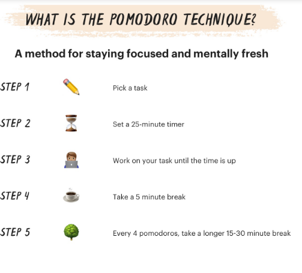
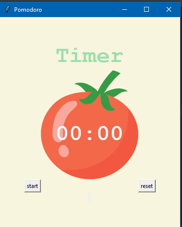
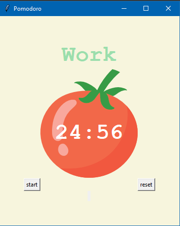
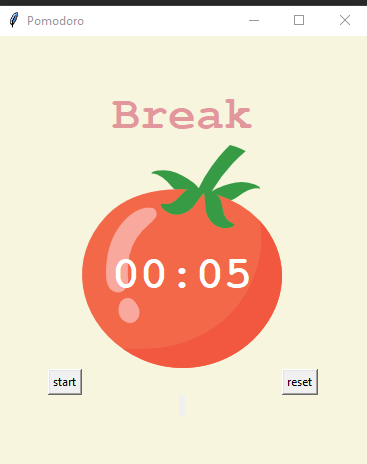
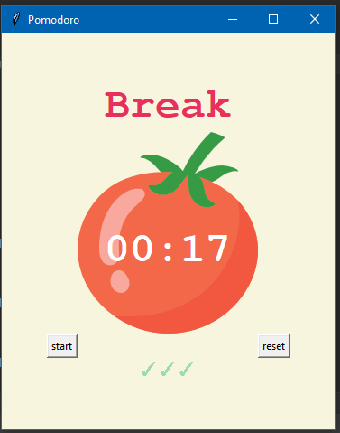

# pomodoro-tool
Pomodoro technique is a popular time management method that asks you to work in alternate pomodoros — focused work sessions — with frequent short breaks to promote sustained concentration and stave off mental fatigue.

1. Get a to-do list and a timer.

2. Set your timer for 25 minutes, and focus on a single task until the timer rings.

3. When your session ends, mark off one pomodoro and record what you completed.

4. Then enjoy a five-minute break.

5. After four pomodoros, take a longer, more restorative 15-30 minute break.

## Start the timer

## Start working

## Take a short break

## Take a long break after four cycles

